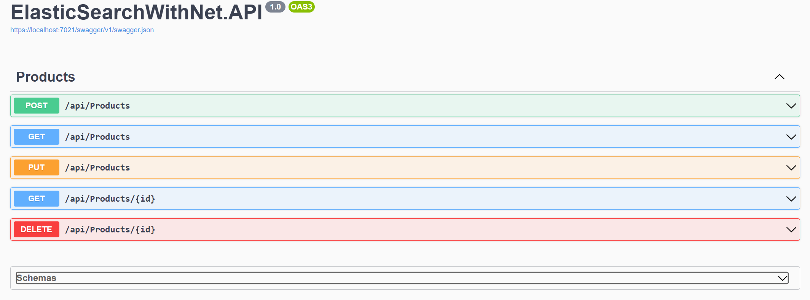

# ElasticSearch with .Net Core and Nest Library

## Basic Endpoints 
The implementation of making requests to Elasticsearch via Nest library on .NET Core has been completed.

## Learning Notes (TR)

[Elasticsearch Installation and Basics](docs/ElasticSearch.md)

[Term level queries](docs/ElasticSearch-TermLevelQueries.md)

[Full text queries](docs/ElasticSearch-FullTextQueries.md)

[Compound & aggregation queries](docs/ElasticSearch-Compound&AggregationQueries.md)

[.NET Nest Library Implementation](docs/ElasticSearch-NESTLibrary.md)

